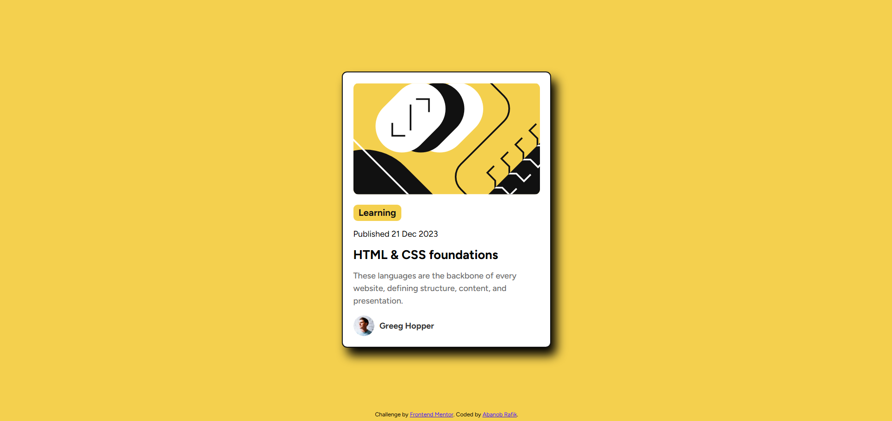

# Frontend Mentor - Blog Preview Card Component Challenge

## Overview

This is my solution to the second challenge on Frontend Mentor - the Blog Preview Card Component. The challenge is to build a blog preview card component that matches the provided design as closely as possible.

## Challenge

The task is to create a simple blog preview card component using HTML and CSS. The component should be centered on the page and should look similar to the design provided by Frontend Mentor.

## Screenshot

## Links

- Challenge URL: [Frontend Mentor - Blog preview card](https://www.frontendmentor.io/challenges/blog-preview-card-ckPaj01IcS)

## Built With

- Semantic HTML5 markup
- CSS custom properties
- Flexbox
